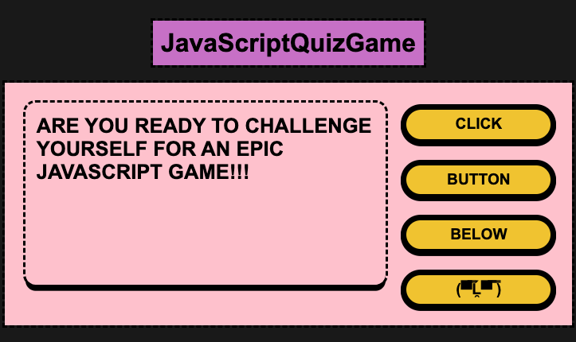
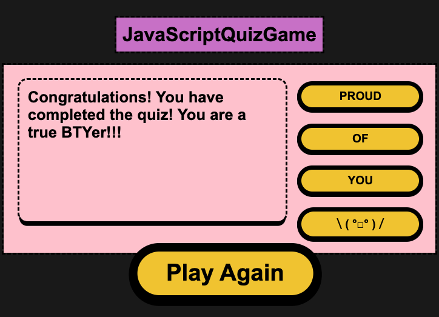

# JavaScriptQuizGame

JavaScript Trivia Game is a simple game built using JavaScript. It consists of multiple choice questions that test your knowledge on JavaScript.

<!-- TABLE OF CONTENTS -->

  
Table of Contents

  <ol>
    <li><a href="#Screenshot">Screenshot</a></li>
    <li><a href="#Technologies Used">Technologies Used</a></li>
    <li><a href="#getting-started">Getting Started</a></li>
    <li><a href="#Planned future enhancements for the game:">Planned future enhancements for the game</a></li>
  </ol>

## *** Screenshot ***
TO BEGIN
- 

THE END
- 

## *** Technologies Used ***
- JavaScript
- HTML
- CSS

## *** Getting Started ***

To play the game, simply follow the link to the deployed game: 

*** https://woonchanjung.github.io/JavaScriptQuizGame/ ***

Once you're on the game page, click the "(▀̿Ĺ̯▀̿ ̿)" button to begin playing. 
You'll be presented with a series of questions and your goal is to get the best score!

## *** Planned future enhancements for the game: ***

- Add more questions to the game
- Allow users to choose the difficulty level of the questions
- Add different languages as well potentially. 
- Create a score or point system
- Create a better layout of the overall game

Thank you for playing our JavaScript Trivia Game!
